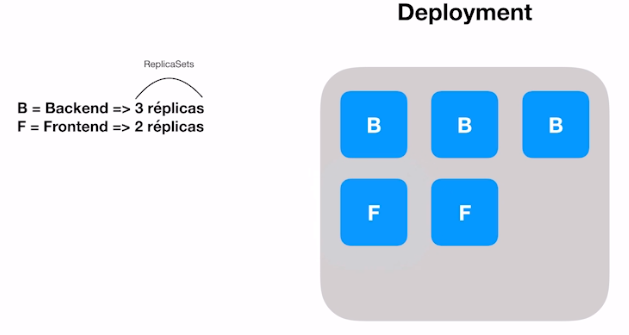

# Kubernetes

O Kubernetes é disponibilizado através de um conjunto de APIs. Normalmente acessos a API usando a CLI: *kubectl*.
Tudo no Kubernetes é baseado em estado.

O Kubernetes trabalha através de clusters. Um dos nós é chamado de master. A função do master é controlar todos os outros nós.

Dentro do nó master, o cluster tem acesso ao *kube-apiserver*, *kube-controller-manager* e *kube-scheduler*. Os outros nós tem acesso ao *kubelet* e *kubeproxy*

## Deployment - Replica Sets


Quando o limite de recursos de um nó é atingido, não é possível subir mais pods, fazendo com que os pods fiquem com estado *pendente*.

## Criando cluster local no K8s
```bash
kind create cluster -n ovalves-cluster

```
## Removendo o cluster local no K8s
```bash
kind delete cluster -n ovalves-cluster
```

## Apontando para o cluster local
```bash
kubectl config use-context kind-ovalves-cluster
```

## Verificando os nodes do cluster
```bash
kubectl get nodes
```

## Criando cluster local usando Manifesto
```bash
❯ kind create cluster -n ovalves-cluster --config kind-cluster/deploy.yaml
```

# Keda Exemplo

## Instalando o Keda
```bash
❯ kubectl apply -f keda-2.10.1.yaml
```

## Criando a imagem docker do app
```bash
❯ sh build_app.sh
```

## Carregando a imagem do app no cluster do kind
```bash
❯ kind load docker-image keda-sample/sample-app -n ovalves-cluster
```

## Deploy dos apps
```bash
❯ kubectl apply -f deployment/
```

## Redis Scaler exemplo
Para escalar a aplicação de exemplo iremos usar o *Redis scaler*:

```bash
❯ kubectl apply -f scalers/redis-hpa.yaml
```

## Verificando os Scalers
```bash
❯ kubectl get scaledobjects

❯ kubectl get hpa
```

## Subindo os apps
```bash
❯ kubectl exec $(kubectl get pods | grep "api" | cut -f 1 -d " ") -- keda-sample redis publish
```

## Removendo os apps
```bash
❯ kubectl exec $(kubectl get pods | grep "api" | cut -f 1 -d " ") -- keda-sample redis drain
```

## Port Forwarding
```bash
❯ kubectl port-forward POD_NAME HOST_PORT:POD_PORT

# ❯ kubectl port-forward sample-app 8000:3003
```