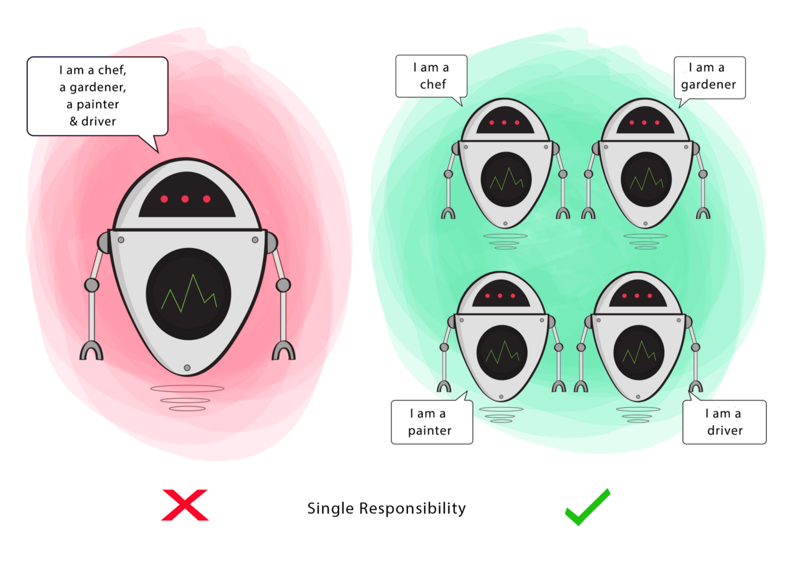
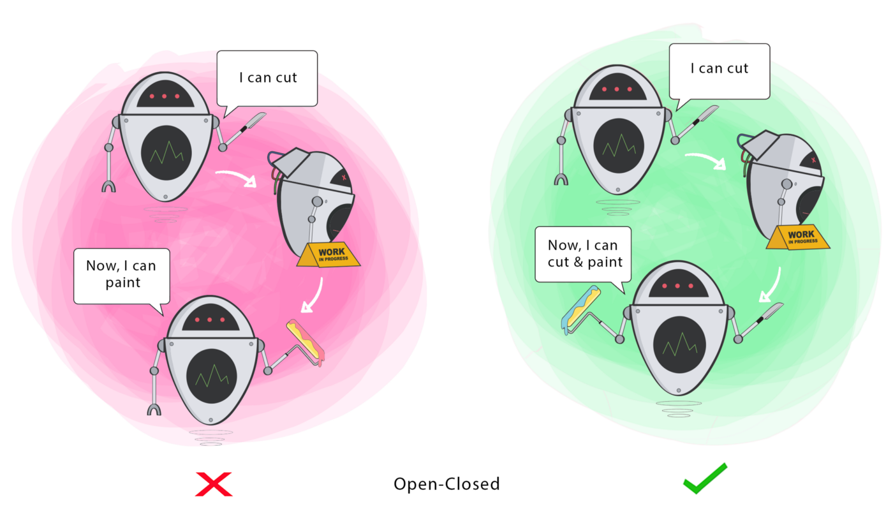
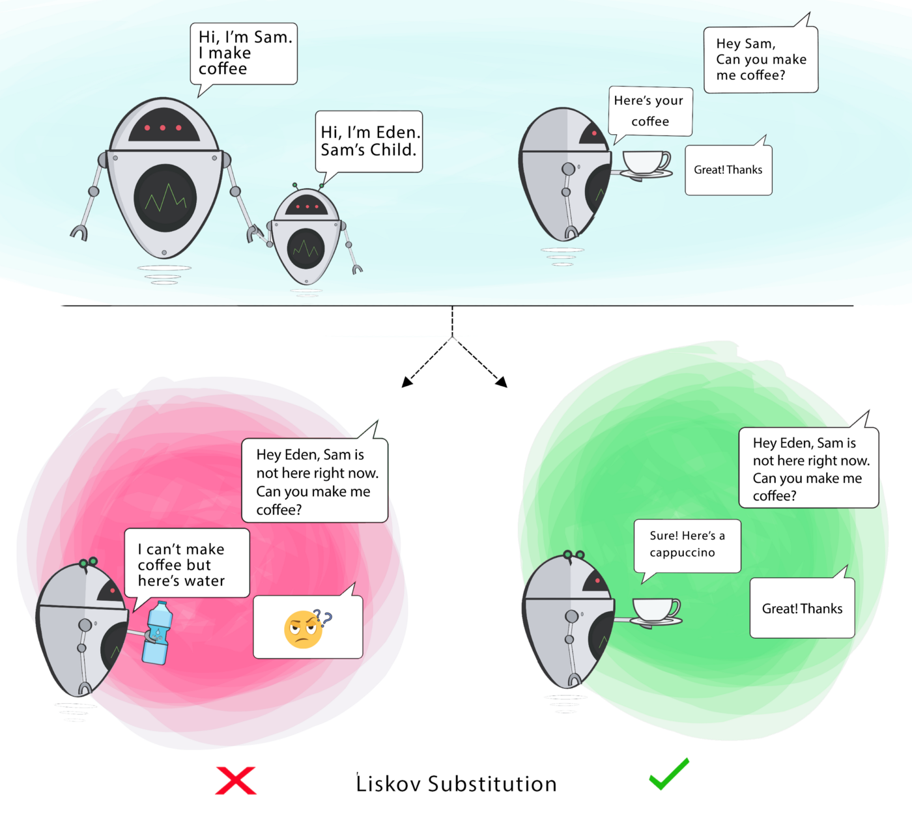
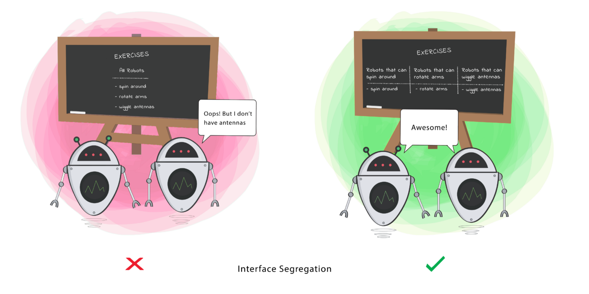
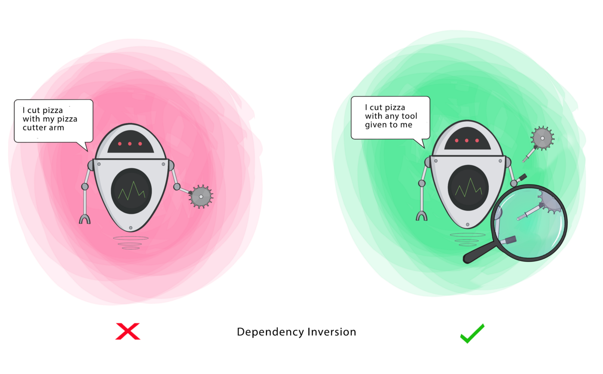

# SOLID
Os princípios do SOLID são um guia de como criar um código que seja fácil de escalar e manter.
Estes cinco princípios foram popularizados por Robert C. Martin.

## S - Single Responsibility
### Uma Classe deve ter uma única responsabilidade.

Se uma classe tiver muitas responsabilidades, aumenta a possibilidade de bugs, porque fazer alterações em uma de suas responsabilidades poderá afetar as outras sem você saber.

Esse princípio visa separar comportamentos para que, se os bugs surgirem após alguma mudança no código, isso não afetará outros comportamentos não relacionados.

---

## O - Open-Closed
### As Classes devem estar abertas para extensão, mas fechadas para modificação.

Alterar o comportamento atual de uma classe afetará todos os sistemas usando essa Classe.

Se você deseja que a classe execute mais funções, a abordagem ideal é adicionar funções ao invés de alterá-las.

Esse princípio visa estender o comportamento de uma classe sem alterar o comportamento existente dessa classe. Isso evita causar bugs onde quer que a classe esteja sendo usada.

---

## L - Liskov Substitution
### Se **S** for um subtipo de **T**, os objetos do tipo **T** em um programa poderão ser substituídos por objetos do Tipo **S** sem alterar nenhuma das propriedades desse programa.

Quando uma classe filha não pode executar as mesmas ações que sua classe pai, isso pode causar erros.

Se você tem uma classe e cria outra classe, ela se torna pai e a nova classe se torna a filha. A classe filha deve poder fazer tudo o que a classe pai pode fazer. Esse processo é chamado de herança.

A classe filha deve ser capaz de processar as mesmas requisições e fornecer os mesmos resultados que a classe pai ou pode fornecer um resultado do mesmo tipo.

A imagem mostra que a classe pai entrega café (pode ser qualquer tipo de café). É aceitável para a classe filha entregar cappuccino porque é um tipo específico de café, mas não é aceitável entregar água.

Esse princípio visa impor consistência para que a classe pai ou sua classe filha possam ser trocadas e usadas da mesma maneira sem causar erros.

---

## I - Interface Segregation
### As classes clientes não devem ser forçados a depender de métodos que não usam.

Esse problema ocorre quando uma classe concreta implementa uma interface, e essa interface define mais ações do que classe concreta necessita. Nesse caso temos um desperdício e essa implementação pode produzir erros inesperados, caso a classe concreta não tenha a capacidade de executar as ações definidas pela interface.

Uma classe deve executar apenas ações necessárias para cumprir seu papel. Qualquer outra ação deve ser removida completamente ou movida para outro lugar, se puder ser usada por outra classe no futuro.

Esse princípio visa dividir um conjunto de ações em conjuntos menores, para que uma classe execute apenas o conjunto de ações necessário.

---

## D - Dependency Inversion
- Módulos de alto nível não devem depender de módulos de baixo nível. Ambos devem depender de abstrações.
- As abstrações não devem depender de classes concretas. As classes concretas devem depender de abstrações.

### Definições
- Módulo de alto nível (ou classe): classe que executa uma ação como uma ferramenta.
- Módulo de baixo nível (ou classe): a ferramenta necessária para executar a ação.
- Abstração: representa uma interface que conecta as duas classes.
- Classe concreta: Como a ferramenta de fato funciona.

Esse princípio visa reduzir a dependência de uma classe de alto nível na classe de baixo nível, introduzindo uma interface.

---
