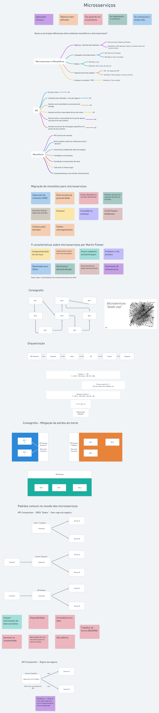
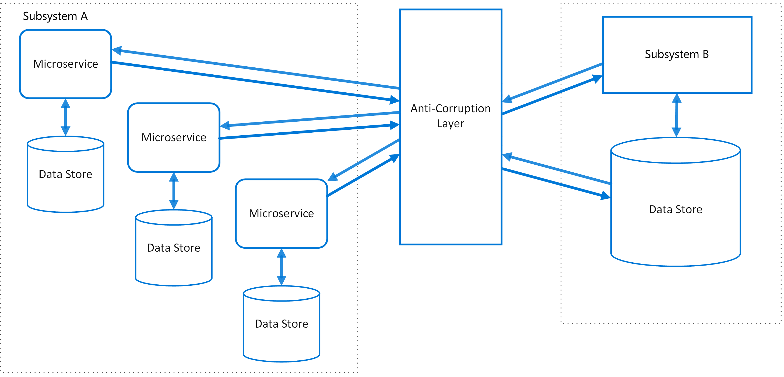

# Arquitetura baseada em microsserviços

## Características

### Smart Endpoint and Dump pipes
Existem duas formas principais para comunicação entre microsserviços:

- Request-Response: Um serviço chama outro serviço através de uma request, geralmente para graver ou ler dados. O serviço então espera uma resposta.

- Observer: Event based. Chamada implícita em que um serviço publica um evento e um ou mais observadores que estavam escutando esse evento executam a lógica de forma assíncrona.

O princípio **Smart Endpoint and Dump pipes** é quando você adota o conceito de descentralização da arquitetura e da lógica do serviço. O microsserviço deve ser capaz de executar a lógica de negócio (Smart Endpoint) recebendo request de mensagens através de **Dump pipes** (requisições simples HTTP) utilizando **Request-Response** ou **Observer** nas comunicações.

## Resiliência
TODO

## Patterns

### API Composition
Necessário ter um **Service Composer** para agregar as informações recebidas dos outros microsserviços

- Prós
    - Compor informações de diversas fontes
- Contras
    - Disponibilidade
    - Inconsistência de dados
    - Aumento da complexidade
    - Alta Latência
- Ponto de atenção
    - Sempre pensar em **Resiliência**

### Decompose by Business Capability
Esse pattern define a decomposição de sistemas monolíticos de acordo com as regras de negócio.
- Separar os microsserviços de acordo com as partes que são *CORE* do sistema
- Pode-se utilizar os bounded contexts do DDD para decompor os microsserviços

### Strangler Application
- Decompor o sistema monolítico em pequenos pedaços tornando-os em microsserviços
- Toda nova feature já é criada como microsserviços
Dessa forma o monolítico vai diminuindo com o tempo.

Pontos de atenção:
- Comunicação do microsserviço com o monolítico pode ser complexa
- Cada microsserviço precisa ter um APM

### ACL - Anti Corruption Layer
Adiciona uma *facade* ou *adapter* entre diferentes sistemas que não compartilham a mesma semântica. Essa camada recebe as requests feitas pelos microsserviços.Esse pattern garante que o design dos microsserviços não seja limitado por dependências externas. Esse padrão foi descrito pela primeira vez por Eric Evans no DDD.

Pontos de atenção:
- ACL pode adicionar latência nas chamadas feitas entre os dois sistemas.
- ACL adiciona outro serviço que deve ser gerenciado e mantido.
- Considere como a camada anticorrupção será dimensionada.
- Certifique-se de que a transação e a consistência de dados sejam mantidas e que possam ser monitoradas.
- Se a camada anticorrupção fizer parte de uma estratégia de migração, leve em consideração se ela será permanente ou se será desativada depois que todas as funcionalidades herdadas forem migradas.

Use esse padrão quando:
- Haja um plano de migração que acontecerá em vários estágios, mas a integração entre os sistemas precisará ser mantida.
- Dois ou mais subsistemas têm semânticas diferentes, mas ainda precisam se comunicar.

Referencia:
- [anti-corruption-layer](https://learn.microsoft.com/en-us/azure/architecture/patterns/anti-corruption-layer)

## C4 Model
TODO