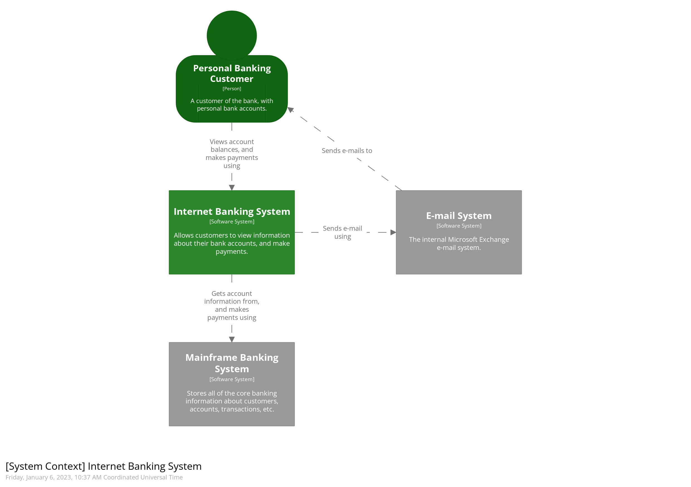
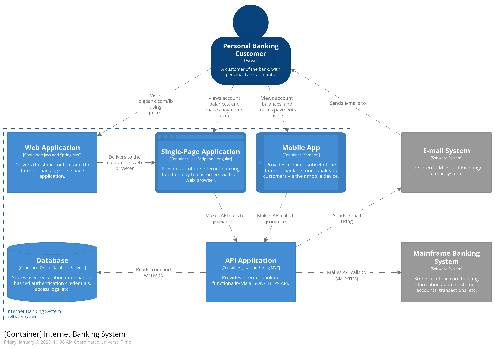

# Arquitetura baseada em microsserviços

## Características

### Smart Endpoint and Dump pipes
Existem duas formas principais para comunicação entre microsserviços:

- Request-Response: Um serviço chama outro serviço através de uma request, geralmente para graver ou ler dados. O serviço então espera uma resposta.

- Observer: Event based. Chamada implícita em que um serviço publica um evento e um ou mais observadores que estavam escutando esse evento executam a lógica de forma assíncrona.

O princípio **Smart Endpoint and Dump pipes** é quando você adota o conceito de descentralização da arquitetura e da lógica do serviço. O microsserviço deve ser capaz de executar a lógica de negócio (Smart Endpoint) recebendo request de mensagens através de **Dump pipes** (requisições simples HTTP) utilizando **Request-Response** ou **Observer** nas comunicações.

## Resiliência
TODO

## Patterns

### API Composition
Necessário ter um **Service Composer** para agregar as informações recebidas dos outros microsserviços

- Prós
    - Compor informações de diversas fontes
- Contras
    - Disponibilidade
    - Inconsistência de dados
    - Aumento da complexidade
    - Alta Latência
- Ponto de atenção
    - Sempre pensar em **Resiliência**

### Decompose by Business Capability
Esse pattern define a decomposição de sistemas monolíticos de acordo com as regras de negócio.
- Separar os microsserviços de acordo com as partes que são *CORE* do sistema
- Pode-se utilizar os bounded contexts do DDD para decompor os microsserviços

### Strangler Application
- Decompor o sistema monolítico em pequenos pedaços tornando-os em microsserviços
- Toda nova feature já é criada como microsserviços
Dessa forma o monolítico vai diminuindo com o tempo.

Pontos de atenção:
- Comunicação do microsserviço com o monolítico pode ser complexa
- Cada microsserviço precisa ter um APM

### ACL - Anti Corruption Layer
Adiciona uma *facade* ou *adapter* entre diferentes sistemas que não compartilham a mesma semântica. Essa camada recebe as requests feitas pelos microsserviços.Esse pattern garante que o design dos microsserviços não seja limitado por dependências externas. Esse padrão foi descrito pela primeira vez por Eric Evans no DDD.

Pontos de atenção:
- ACL pode adicionar latência nas chamadas feitas entre os dois sistemas.
- ACL adiciona outro serviço que deve ser gerenciado e mantido.
- Considere como a camada anticorrupção será dimensionada.
- Certifique-se de que a transação e a consistência de dados sejam mantidas e que possam ser monitoradas.
- Se a camada anticorrupção fizer parte de uma estratégia de migração, leve em consideração se ela será permanente ou se será desativada depois que todas as funcionalidades herdadas forem migradas.

Use esse padrão quando:
- Haja um plano de migração que acontecerá em vários estágios, mas a integração entre os sistemas precisará ser mantida.
- Dois ou mais subsistemas têm semânticas diferentes, mas ainda precisam se comunicar.

Referencia:
- [anti-corruption-layer](https://learn.microsoft.com/en-us/azure/architecture/patterns/anti-corruption-layer)

### BFF - Backends for Frontends
Crie serviços de back-end específicos para serem consumidos por diferentes tipos de frontends. Esse padrão é útil quando você deseja segregar o back-end de acordo com o frontend.

Because each backend is specific to one interface, it can be optimized for that interface. As a result, it will be smaller, less complex, and likely faster than a generic backend that tries to satisfy the requirements for all interfaces.

Issues and considerations
- Consider how many backends to deploy.
- If different interfaces (such as mobile clients) will make the same requests, consider whether it is necessary to implement a backend for each interface, or if a single backend will suffice.
- Code duplication across services is highly likely when implementing this pattern.
- Frontend-focused backend services should only contain client-specific logic and behavior. General business logic and other global features should be managed elsewhere in your application.
- Think about how this pattern might be reflected in the responsibilities of a development team.
- Consider how long it will take to implement this pattern. Will the effort of building the new backends incur technical debt, while you continue to support the existing generic backend?

Use this pattern when:
- A shared or general purpose backend service must be maintained with significant development overhead.
- You want to optimize the backend for the requirements of specific client interfaces.
- Customizations are made to a general-purpose backend to accommodate multiple interfaces.
- An alternative language is better suited for the backend of a different user interface.

This pattern may not be suitable:
- When interfaces make the same or similar requests to the backend.
- When only one interface is used to interact with the backend.

Referencia:
- [backend-for-frontend](https://learn.microsoft.com/en-us/azure/architecture/patterns/backends-for-frontends)

### Transactional Outbox

Transactional Outbox é um padrão de garantia de entrega utilizado na publicação de eventos entre sistemas. Esse padrão é importante quando não podemos garantir a atomicidade da operação de chamadas entre sistemas.

Opções de bancos:
- RDBMS
- KV -> DynamoDB
- Cache -> Redis -> Persistir os dados em disco

This pattern has the following benefits:

- Messages are guaranteed to be sent if and only if the database transaction commits
- Messages are sent to the message broker in the order they were sent by the application

This pattern has the following drawbacks:
- Potentially error prone since the developer might forget to publish the message/event after updating the database.

This pattern also has the following issues:
- The Message Relay might publish a message more than once. It might, for example, crash after publishing a message but before recording the fact that it has done so. When it restarts, it will then publish the message again. As a result, a message consumer must be idempotent, perhaps by tracking the IDs of the messages that it has already processed. Fortunately, since Message Consumers usually need to be idempotent (because a message broker can deliver messages more than once) this is typically not a problem.

Referencia:
- [transactional-outbox](https://microservices.io/patterns/data/transactional-outbox.html)

### Secret Manager
O Secrets Manager permite o gerenciamento das credenciais dos microsserviços. Através de uma chamada de API para o Secrets Manager você pode recuperar as senhas dos serviços.

Opções:
- [vault](https://www.vaultproject.io/)

### Logs
- Os logs devem ser padronizados
- Devemos usar elastic search nos logs
- Devemos unificar as linhas da stack trace para uma linha de log
    - Elastic Stack
    - Filebeat

## C4 Model
Context, Containers, Components, and Code

Referencia:
- [C4 Model](https://c4model.com/)

### Entendendo os Níveis

#### Person
A person represents one of the human users of your software system (e.g. actors, roles, personas, etc).

#### Software System
A software system is the highest level of abstraction and describes something that delivers value to its users, whether they are human or not. This includes the software system you are modelling, and the other software systems upon which your software system depends (or vice versa). In many cases, a software system is "owned by" a single software development team.

#### Container
A container represents an application or a data store. A container is something that needs to be running in order for the overall software system to work. In real terms, a container is something like:

- Server-side web application
- Client-side web application
- etc

#### Component
A component is a grouping of related functionality encapsulated behind a well-defined interface.

### System Context - Diagram

### Container - Diagram
