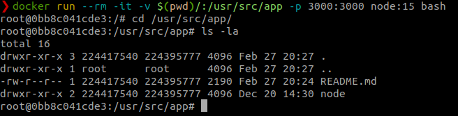

# Docker

## O que é Docker

Docker é uma plataforma open source que possibilita o empacotamento de uma aplicação dentro de um container. Uma aplicação consegue se adequar e rodar em qualquer máquina que tenha essa tecnologia instalada.

## Imagens
```
❯ docker images
REPOSITORY                                  TAG                   IMAGE ID       CREATED         SIZE
dev-spv-video-catalog                       latest                27065b83abaa   3 days ago      1.29GB
workers-notifier-worker                     latest                52de2daf72fa   13 days ago     1.33GB
notification-system/notification-service    1.0                   7f80fd98c253   13 days ago     579MB
bitnami/cassandra                           latest                f93693a2e149   13 days ago     517MB
bitnami/zookeeper                           latest                12ac12715506   2 weeks ago     511MB
bitnami/kafka                               latest                dfb0dce1716b   2 weeks ago     552MB
dev-notification-server                     latest                db1f50b92a0a   2 weeks ago     579MB
```

### Apagando uma imagem
```
❯ docker rmi 27065b83abaa
```

### Criando uma imagem
> Dockerfile
```Dockerfile
FROM php:zts

WORKDIR /app

COPY src/ src/
COPY composer.json composer.json

RUN pecl install parallel
RUN docker-php-ext-enable parallel

RUN apt-get update && apt-get install -y zlib1g-dev libpng-dev libjpeg-dev
RUN docker-php-ext-configure gd --with-jpeg
RUN docker-php-ext-install gd
RUN pecl install xdebug && docker-php-ext-enable xdebug

RUN curl -sS https://getcomposer.org/installer | php -- --install-dir=/usr/local/bin --filename=composer
```

```
docker build -t php-parallel:1.0 .
```

## Portas
### Entrypoint
Usado para parâmetros fixos na execução do container

```Dockerfile
ENTRYPOINT [ "echo", "hello "]
```
### CMD
Usado para parâmetros dinâmicos na execução do container

```Dockerfile
CMD [ "World!"]
```

## Networks
```
docker network ls
```

Tipos:
- bridge
- host
- overlay


## Bind Mounts
...

## Volumes
...

## Comandos úteis
...

## Criando imagem node
```
docker run --rm -it -v $(pwd)/:usr/src/app -p 3000:3000 node:15 bash
```


> imagem node

```
npm init
npm install express --save
touch index.js
```

```js
const express = require('express');
const app = express();
const port = 3000;

app.use(function(req, res, next) {
    res.send('<h1>Olá Mundo!!!</h1>')
});

app.listen(port, function() {
    console.log('listening on port ' + port)
});
```