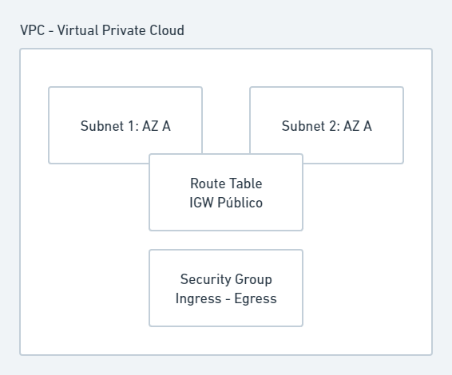

# Terraform
[Terraform Learning guides]('https://learn.hashicorp.com/terraform')

## Terraform init
Initialize a new or existing Terraform working directory by creating
initial files, loading any remote state, downloading modules, etc.

This is the first command that should be run for any new or existing
Terraform configuration per machine. This sets up all the local data
necessary to run Terraform that is typically not committed to version
control.

This command is always safe to run multiple times. Though subsequent runs
may give errors, this command will never delete your configuration or
state. Even so, if you have important information, please back it up prior
to running this command, just in case.

```bash
cd iac-sample
terraform init

Initializing the backend...

# Initializing provider plugins...
# - Finding latest version of hashicorp/local...
# - Installing hashicorp/local v2.2.3...
# - Installed hashicorp/local v2.2.3 (signed by HashiCorp)

# Terraform has created a lock file .terraform.lock.hcl to record the provider
# selections it made above. Include this file in your version control repository
# so that Terraform can guarantee to make the same selections by default when
# you run "terraform init" in the future.

# Terraform has been successfully initialized!

# You may now begin working with Terraform. Try running "terraform plan" to see
# any changes that are required for your infrastructure. All Terraform commands
# should now work.

# If you ever set or change modules or backend configuration for Terraform,
# rerun this command to reinitialize your working directory. If you forget, other
# commands will detect it and remind you to do so if necessary.
```

## Terraform plan
Generates a speculative execution plan, showing what actions Terraform would take to apply the current configuration.
This command will not actually perform the planned actions.
```bash
terraform plan
```

## Terraform apply
Creates or updates infrastructure according to Terraform configuration files in the current directory.
```bash
terraform apply
```

## Terraform vs Ansible
TODO

## Outputs
TODO

## Data Sources
TODO

## Variáveis
TODO

## Criando cluster Kubernetes

### VPC

> VPC


