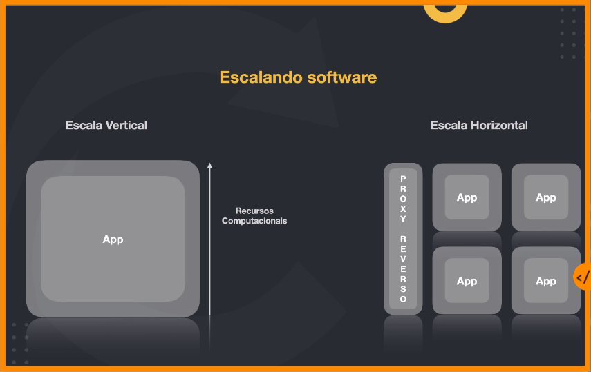
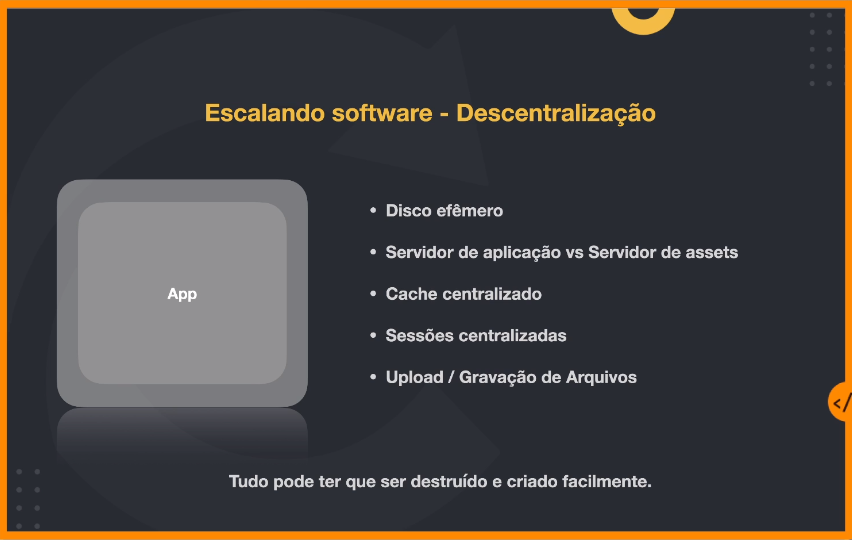

# Fundamentos da Arquitetura de Software

## Pilares da arquitetura de software
- Estruturação
    - Fácil evolução, componentização para atender os objetivos de negócio
- componentização
- Relacionamento entre sistemas
- Governança
    - O software precisa ter padronização, regras, documentação, definições que fique claro pra todo mundo; linguagens, protocolos e sistemas que a gente vai utilizar para se comunicar.

## Requisitos arquiteturais
- Performance
    - Por exemplo, quais são os Requisitos Arquiteturais para a performance? Por exemplo: a aplicação tem um contrato que diz que cada requisição não pode passar de 500 milissegundos. Isso é um requisito de performance.

- Armazenamento
    - Se a empresa usa a AWS, então vamos utilizar diversos tipos de banco de dados, inclusive o Dynamo DB, por exemplo, ou os dados têm que cumprir regulações. Então, se o software estiver rodando na Europa, os dados vão ter que estar em data centers da Europa.

- Escalabilidade
    - Como esse software vai escalar? Eu vou desenvolver o software, ele vai escalar horizontalmente? Verticalmente? Como é que eu vou trabalhar nesse processo de escala? Eu vou ter um load balancer? Como vai funcionar esse meu load balancer? Vai funcionar no formato round-robin ou, por exemplo, eu posso ter diversas máquinas com configurações diferentes? E como elas vão balancear a carga, já que elas têm configurações diferentes? Tudo isso são requisitos arquiteturais.

- segurança
    Requisitos Arquiteturais também envolvem, por exemplo, segurança. Se a aplicação é um e-commerce e receber transações via cartão de crédito, em relação à parte de segurança, o sistema precisa ter certificações PCI, tudo tem que rodar criptografado, etc. Esse é um exemplo de Requisitos Arquiteturais na área de segurança.

## Características arquiteturais
### Operacionais
- Disponibilidade
    - Quanto o meu sistema vai ficar no ar? Ele vai ficar 24/7? Qual é o nível de SLA? Qual é o nível de SLO? SLO são os nossos goals, o objetivo, aonde eu quero garantir. E o SLA é quanto eu combinei com o meu cliente.

- Recuperação de desastres
    -  Como que eu vou fazer para recuperar quando meu sistema estiver fora do ar? Isso é uma das coisas mais importantes conforme trabalhamos com sistemas que trabalham cada vez mais em missões críticas.
    - O site ficou fora do ar, o que eu tenho que fazer? Como eu tenho que agir? Depois que esse problema aconteceu, como eu vou mitigar esse problema para evitar que aconteça novamente? Como o sistema consegue se recuperar? O que acontece, por exemplo, se cair uma região da AWS que o seu sistema está?

- Performance
    - Pensar em latência e throughput
    - O quanto de performance eu quero ter no meu sistema? Quanto esse sistema tem que suportar?

- Recuperação e backup
    - Como está sendo feito o backup do software?

- Confiabilidade e Segurança

### Estruturais
- Configurável
    - A aplicação precisa ser facilmente configurávekm uu seja, eu preciso alterar uma conexão com o banco de dados, e como é que eu faço? Eu tenho que alterar de uma forma hard coded? Ou eu vou trabalhar com um arquivo de variável de ambiente, onde eu falo qual é a minha variável de ambiente e ele utiliza essas variáveis para passar uma string de conexão com o banco de dados?
- Extensibilidade
    - Sua aplicação tem que estar pensada para que ela consiga crescer, ou seja, ela tem que crescer de forma com que as coisas possam ser plugadas nela. E normalmente essas coisas que são plugadas muitas vezes são aspectos de terceiros.
- Fácil Instalação
    - A aplicação, precisa ter fácil instalação.
- Reuso de componentes
- Internacionalização
- Fácil Manutenção
- Fácil Suporte (logs, debugging)
    - O suporte da aplicação é você realmente garantir há uma área de sustentação. Essa área garante que seu software está rodando de forma correta e que você consiga ver rapidamente se está acontecendo algum problema.

### Cross Cutting
- Acessibilidade
    - Você tem que estar muito ciente qual vai ser o público que vai acessar sua aplicação.

- Processo de retenção e recuperação de dados
    - Hoje em dia existem formas interessantes para se trabalhar com dados que você precisa e que você utiliza a toda hora. Devemos pensar em como vamos acessar esses dados. Vamos deixar os dados ali no banco rodando localmente? Há casos onde existem dados que você não utiliza a toda hora, mas você precisa desses dados por questões de compliance, questões legais ou mesmo para criar relatórios para área de negócio. Então, o que você pode fazer é simplesmente pegar esses dados, compactar e automaticamente ir deixando guardado em um storage que acabam sendo mais baratos. O Elastic Search trabalha assim. Se você pegar, por exemplo, o Prometheus, que utiliza um Time Series Database, você vai perceber que ele tem muito mais precisão nas métricas, utilizando os dados mais quentes. E quanto mais longe estiverem aquelas informações das métricas que você vai utilizar, vai diminuindo a precisão.

- Autenticação e Autorização
    - Quando estamos trabalhando em uma Arquitetura distribuída, normalmente usamos um identity provider, ou seja, um provedor de Identidade. Precisamos pensar em como os microsserviços devem acessar o sistema de autenticação?

- Requisitos Legais (Jurídico)
    - Quanto tempo esses dados vão estar mantidos? Onde esses dados vão ter que ser mantidos? Tudo o que acontece na sua aplicação vai ter que estar em conformidade com o país onde você está rodando, com as leis que você está rodando e isso aí é algo que vai ter que ser pensado.

- Requisitos de Privacidade
- Requisitos de Segurança
- Requisitos de Usabilidade
- API Gateway
    - É basicamente um mecanismo que fica mais na borda da sua aplicação, que todo mundo que acessa, antes de cair na sua aplicação. E ali você consegue colocar políticas de autenticação, políticas de timeout, políticas de quantidade de requisições que vão poder ser feitas.

## Métricas para medir a performance

### O que é performance no final das contas?
Performance é o desempenho que um software possui para completar um determinado workload (carga de trabalho).

### Latência ou o famoso response time.
Toda vez que, por exemplo, você fizer uma requisição para um software, até você fazer a chamada dessa requisição, até o software processar essa chamada e ele retornar o resultado para a gente, esse tempo é considerado a latência. É muito mais comum, muitas vezes escutarmos sobre o Response Time.

### Throughput
O throughput, nos mostra o quanto de requisição esse software consegue aguentar.

### Aumentando a performance
A primeira coisa para conseguir melhorar a performance do meu software é diminuir a latência, isto é, o Response Time tem que ser menor. Se eu conseguir diminuir o Response Time eu consigo melhorar a performance. Ou seja, como eu consigo medir isso nesse nosso caso? Normalmente, a medida da latência é feita em milissegundos, se você começar já a medir a latência em segundos provavelmente o seu sistema já não é tão performático.

A nossa latência é afetada pelo tempo de processamento da aplicação, rede e chamadas externas. Então, isso é algo extremamente importante e que às vezes deixamos de levar em consideração.

Outra forma de aumentar a performance é aumentando o throughput.

### Principais razões para baixa performance
- Processamento ineficiente
- Recursos computacionais limitados
- Trabalhar de forma bloqueante
- Acesso serial a recursos

### Principais formas para aumentar a performance
- Escala de capacidade computacional (CPU, Disco, Memória, Rede)
- Lógica por trás do software (Algoritmos, queries, overhead de frameworks)
- Concorrência e paralelismo
- Banco de dados (tipos de bancos, schema)
- Caching
    - Caching Exclusivo
    - Caching Compartilhado
    - Edge Computing
        - CDN

## Escalabilidade
### Escalabilidade é a capacidade de sistemas suportarem o aumento (ou a redução) dos workloads incrementando (ou reduzindo) o custo em menor ou igual proporção.

### Escalando software - Descentralização

### Escala de banco de dados
- Aumentando os recursos computacionais
- Distribuindo responsabilidade (escrita vs leitura)
- Shards de forma horizontal
- Serverless
- Otimização de queries e índices
    - Trabalhe com índices de forma consciente
    - APM (Application Performance monitoring) nas queries
    - Explain nas queries
    - CQRS (Command Query Responsibility Segregation)

### Proxy Reverso
Um proxy reverso é um servidor que fica na frente dos servidores web e encaminha as solicitações do cliente para esses servidores web.

Soluções populares:
- Nginx
- HAProxy
- Traefik

### Resiliência
Resiliência é um conjunto de estratégias adotadas **intencionalmente** para a **adaptação** de um sistema para quando uma falha ocorre.

#### Proteger e ser protegido
- Um sistema em uma arquitetura distribuída precisa adotar mecanismos de autopreservação para garantir ao máximo sua operação com **qualidade**
- Um sistema não pode ser **egoísta** ao ponto de realizar mais requisições em um outro sistema que está falhando
- Um sistema lento no ar muitas vezes é pior do que um sistema fora do ar

#### Health Check
TODO

#### Rate Limiting
Protege o sistema baseado em quantas requisições ele foi projetado para suportar

#### Circuit Breaker
Protege o sistema fazendo com que as requisições feitas para ele sejam negadas: Ex: Erro 500

#### API Gateway
TODO

#### Service Mesh
TODO

#### Comunicação Assíncrona
TODO

#### Garantias de entrega com Retry
TODO

#### Garantias de entrega com Kafka
TODO

#### Garantias de recebimento
TODO

#### Observabilidade
TODO

#### Transactional outbox
Salvar os dados em uma tabela temporária antes de enviar os dados da mensagem para o Kafka. Após a confirmação de recebimento
da mensagem pelo Kafka, podemos apagar a mensagem da tabela temporária.

#### Idempotência e políticas de fallback
TODO
