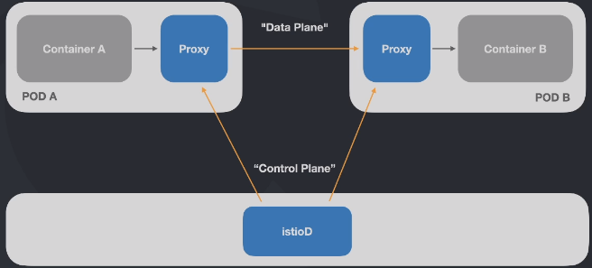
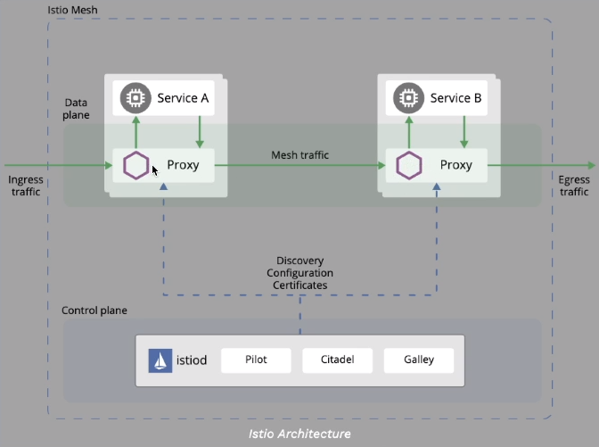

# Service Mesh com Istio
Simplifica a observabilidade, gerenciamento de tráfego, segurança e política com service mesh.

> [istio](https://istio.io/)
> [kiali](https://kiali.io/)

## Service Mesh
Service mesh (malha de serviços) é uma camada extra adicional que tem a função de
para monitor e modificar em tempo real o trafego das aplicações, bem como elevar o nível
de segurança e confiabilidade de todo ecossistema

## Istio
Pode ser usado com:
- Kubernetes
- Apache Mesos
- Consul
- Nomad

### Principais Recursos
- Gerenciamento de trafego
    - gateways (entrada e saída)
    - Load balancing
    - Timeout
    - Políticas de retry
    - Circuit breaker
    - Fault Injection
- Observabilidade
    - Métricas
    - Traces distribuidos
    - Logs
- Segurança
    - Main-in-the-middle
    - mTLS
    - AAA (Authentication, Authorization, Audit)

### Arquitetura do Istio


> sidecar proxy


> istiod

### Criando cluster K8s com K3D
```bash
k3d cluster create -p "7000:30000@loadbalancer" --agents 2
```


### Criando tunnel com minikube
```bash
minikube tunnel
```

### Verificando o serviço do Kiali no K8s
```bash
kubectl -n istio-system get svc kiali
```


### Instalando Istio no cluster
```bash
istioctl install
```

#### Injetando Envoy sidecar proxies
Adicione um label de namespace para o Istio injetar automaticamente os sidecar proxies do Envoy no deploy da aplicação

```bash
kubectl label namespace default istio-injection=enabled
```

#### Instalando os Addons do Istio
```bash
kubectl apply -f https://raw.githubusercontent.com/istio/istio/master/samples/addons/grafana.yaml
kubectl apply -f https://raw.githubusercontent.com/istio/istio/master/samples/addons/jaeger.yaml
kubectl apply -f https://raw.githubusercontent.com/istio/istio/master/samples/addons/kiali.yaml
kubectl apply -f https://raw.githubusercontent.com/istio/istio/master/samples/addons/prometheus.yaml
```

### Gerenciamento de trafego

#### Gateway
Gerencia a entrada e saída do trafego. Trabalha nas layers 4-6, garantindo o gerenciamento de portas, host e TLS.
É conectado diretamente a um Virtual Service que é responsável pelo roteamento.

Tipos:
- Ingress Gateway
- Egress Gateway

#### Virtual Service
Roteador de requisições para um serviço.

Com o Virtual Service podemos configurar regras para:
- Roteamento de trafego
- Subsets
- Fault Injection
- Retries
- Timeout
