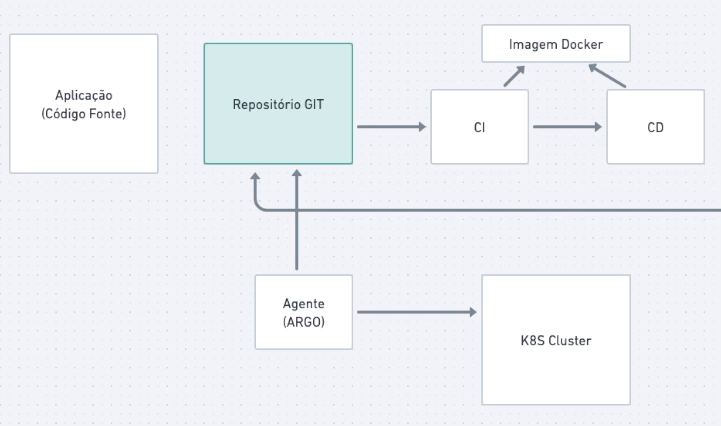

# Gitops



## Criando a imagem
```bash
docker build --tag gitops-node-server:latest --no-cache .
```

## Executando a imagem
```bash
docker run --rm -p 3000:3000 gitops-node-server:latest
```

## Matando o container
```bash
docker stop $(docker ps -a -q)
```

## Kustomize
> https://kustomize.io/

## ArgoCD

### Install Argo CD
```bash
kubectl create namespace argocd
kubectl apply -n argocd -f https://raw.githubusercontent.com/argoproj/argo-cd/stable/manifests/install.yaml
```

### Port Forwarding¶
```bash
kubectl port-forward svc/argocd-server -n argocd 8080:443
```

### Login Using The CLI
```bash
kubectl -n argocd get secret argocd-initial-admin-secret -o jsonpath="{.data.password}" | base64 -d; echo
```

## Conectando repo do git
> https://argo-cd.readthedocs.io/en/stable/user-guide/private-repositories/
```bash
argocd repo add git@github.com:user/sample_repo.git --ssh-private-key-path ~/.ssh/private_key_file --server localhost:8000 --insecure
```