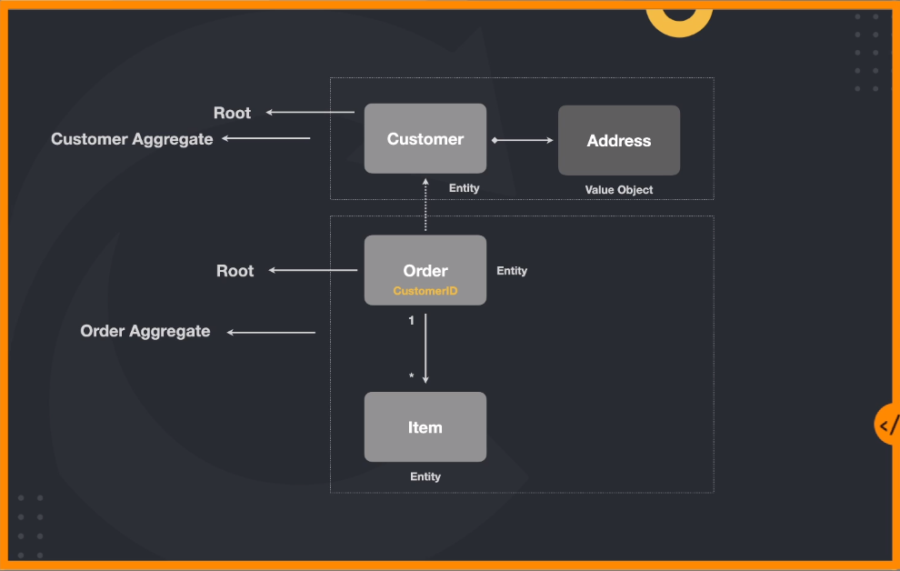

# DDD: Modelagem Tática e Patterns

## Elementos táticos
Quando estamos falando sobre DDD e precisamos olhar mais a fundo um bounded context.

Precisamos ser capazes de modelarmos de forma mais assertiva os seus principais componentes, comportamentos e individualidades, bem como suas relações.

## Entidades
"Uma entidade é algo único que é capaz de ser alterado de forma contínua durante um longo período de tempo."
> Vernon, Vaughn. Implementing Domain-Driven Design

"Uma entidade é algo que possui uma continuidade em seu ciclo de vida e pode ser distinguida intependente dos atributos que são importantes para a aplicação do usuário. Pode ser uma pessoa, cidade, carro um ticket de loteria ou uma transação bancária."
> Evans, Eric. Domain-Driven Design

### Entidade anêmica
TODO

### Entidades e Domínio rico
TODO

### Consistência
TODO

### Princípio da Autovalidação
Todas as entidades do sistema precisam se autovaliar, para garantir que nenhum de seus atributos recebam dados incorretos vindos de outras partes do sistema.

### Entidade vs ORM
TODO

## Value Objects
Quando você se preocupa apenas com os atributos dos elementos de uma model, classifique isso como um Value Object.
- Os value Objects devem ser imutáveis.
- Os value Objects precisam se autovalidas
- Os Value Objects não possuem ID

## Aggregate
Um agregado é um conjunto de objetos associados que tratamos como uma unidade para propósito de mudança de dados.

