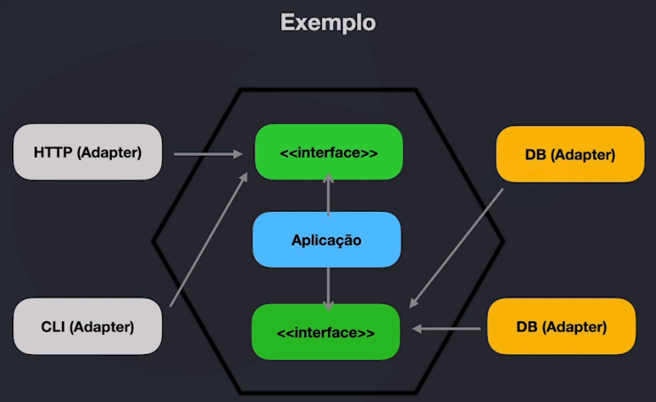

# Arquitetura Hexagonal (Ports and Adapters)

## Principais Ganhos

* Visão de futuro
* Limites bem definidos
* Troca e adição de componentes
* Escala
* Otimizações frequentes
* Preparado para mudanças
* Definição de limites e proteção nas regras da aplicação
* Componentização e desaclopamento
    * Logs
    * Cache
    * Upload
    * Banco de dados
    * Comandos
    * Filas
    * HTTP / API's / GraphQL
* Facilidade na quebra para microserviços

## Exemplo Arquitetura Hexagonal

[O principal conceito que faz a Arquitetura Hexagonal funcionar é o uso do Dependency Inversion Principle](../4_solid/php/DIP/dip.php)
